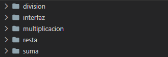
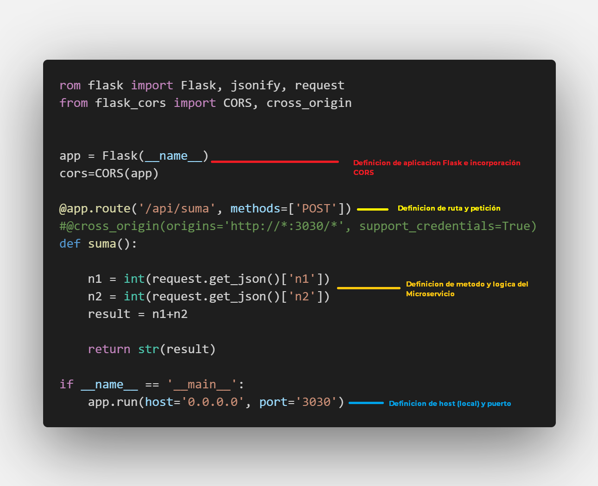
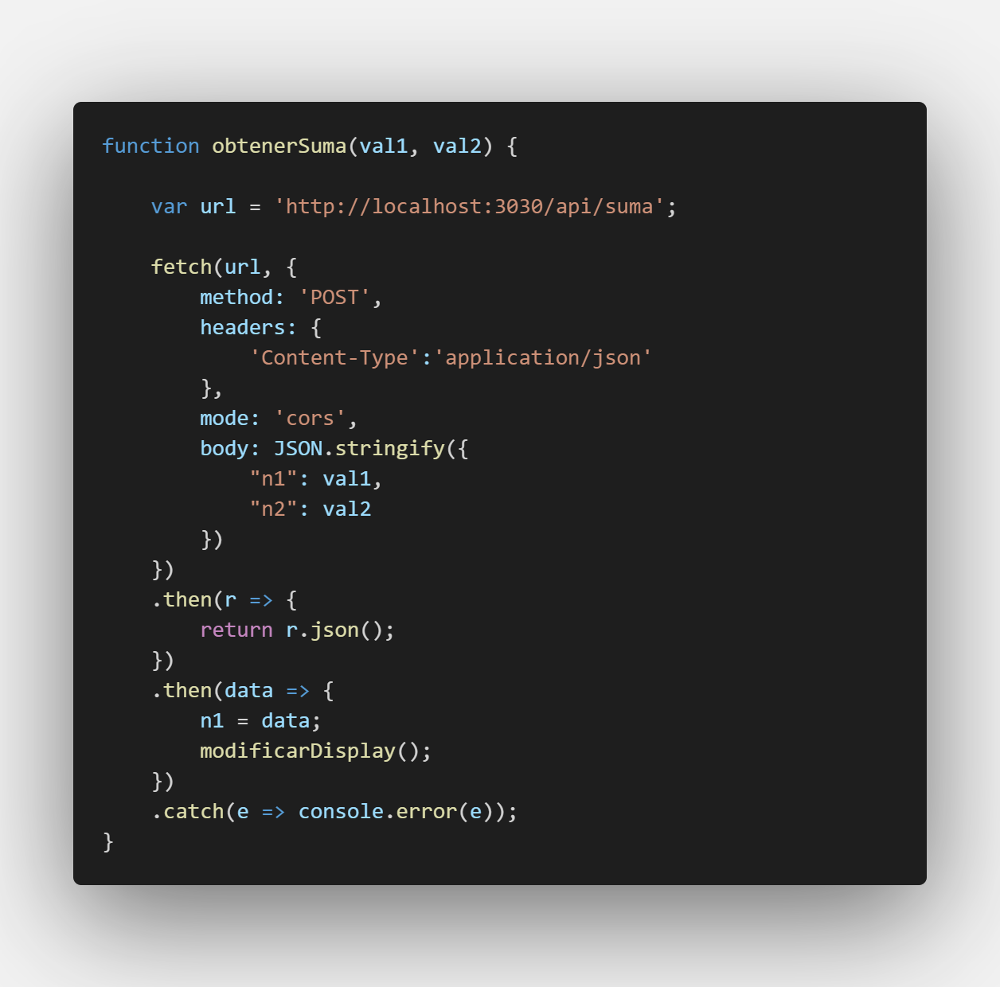
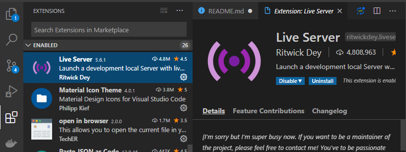
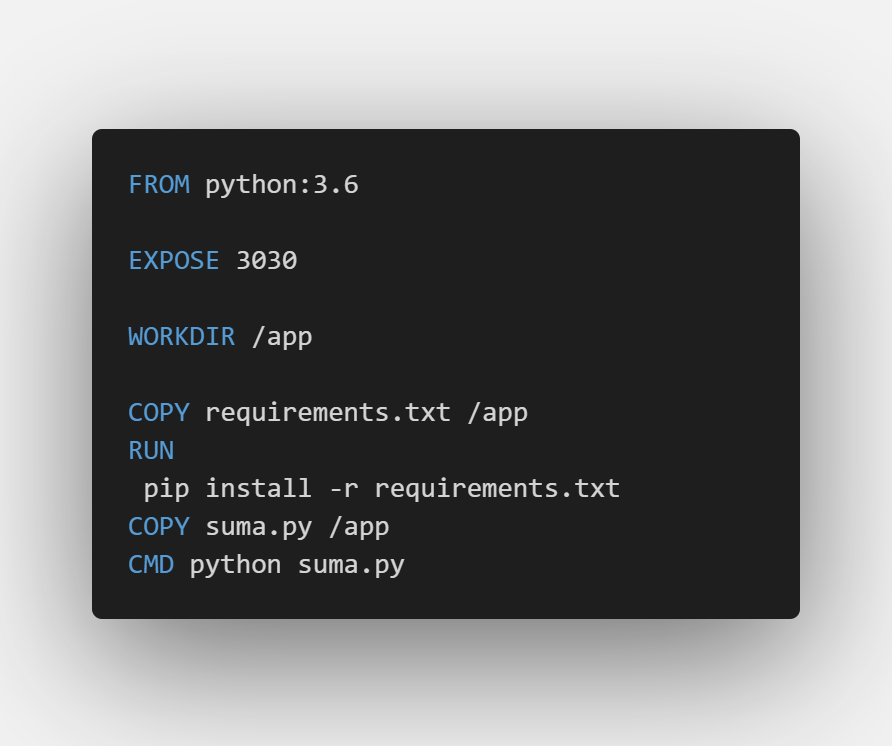
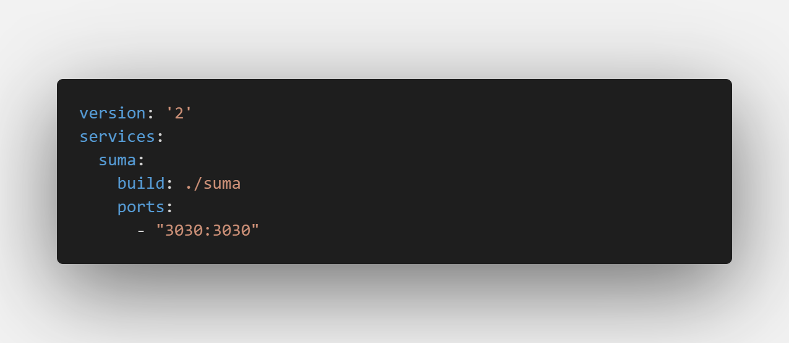

# Microservicios y Contenedores para una Calculadora de enteros

Se ve una introducción a microservicios utilizando el Framework Flask, Flask-cors en el back-end para la creacion de microservicios para una calculadora donde cada operacion representa un servicio aislado y separado. En el Front-end se hace uso de Live-server, fetch y Json para comunicacion con los microservicios. Se explica entonces el proceso de correr la aplicación por medio de la activacion de los microservicios y luego dar paso al uso de Docker para la ejecucion de microservicios en contenedores sin necesidad de la activacion o instalacion de dependencias.

## Integrantes

- Cristian Felipe Patiño Caceres - 20141020079
- Cristian David Santoyo Parra - 20141020077
- Brian Giovanny Alfonso Rodriguez - 20151020600
- Catalina Hernandez Casas - 20201099034

## Informatica I

### Docente

- Alejandro Paolo Daza

## Ejercicio

Se plantea establecer una arquitectura orientada a microservicios usando el micro-framework flask para ofrecer la implementación de los servicios de suma, resta, multiplicación y división.

En el repositorio se deben exponer las tecnologías seleccionadas para ofrecer los servicios propios de este tipo de arquitecturas teniendo en cuenta que las operaciones se ofrecen con flask.

La explicación de despliegue así como la explicación de las herramientas seleccionadas debe ser clara en el README del proyecto.

# Marco teórico de Tecnologías de Microservicios empleadas

A continuación, un breve fundamento teórico de las siguientes tecnologías:

- Flask
- Flask Cors
- Live-Server
- Docker

## Flask

Flask es un “micro” Framework escrito en Python y concebido para facilitar el desarrollo de Aplicaciones Web bajo el patrón MVC.

- Flask puede ser muy conveniente, para determinadas aplicaciones no se necesitan muchas extensiones y es suficiente.
- No se necesita una infraestructura con un servidor web para probar las aplicaciones sino de una manera sencilla se puede correr un servidor web para ir viendo los resultados que se van obteniendo.
- Es compatible con python 3
- Permite el uso de sesiones
- Es Open source

En microframewors, la palabra Micro se refiere a que Flask ayuda a mantener el core de una aplicación web de manera simple pero extensible. Por defecto, flask no incluye una capa de abstracción de bases de datos o formularios de validación. En vez de esto, Flask admite extensiones para adicionar tales funcionalidades a las aplicaciones como si estas fueran implementadas en Flask por sí mismo. Flask puede ser “micro” pero está listo para su uso en producción en una variedad de necesidades.
Flask tienen muchos valores de configuración, con valores por defecto y convenciones, Por convención, plantillas y archivos estáticos sin almacenados en subdirectorios dentro del árbol fuente de Python de la aplicación, con los nombres template y static respectivamente.
Una vez que Flask esté funcionando, encontraras una variedad de extensiones disponibles en la comunidad para integrar tu proyecto para producción, de la manera personalizada más posible.
Una aplicación mínima en Flask debe parecerse a:

from flask import Flask

app=Flask( ** name **)

@app.route('/')

def hell_world():

return 'Hello, world!'

Este código realiza lo siguiente:

1. Se importó una clase Flask.
2. Se creó una instancia de esta clase. El primer argumento es el nombre del módulo de la aplicación o el paquete. Si se importa como aplicación será ** name ** , si es un módulo será ** main **
3. Se usa route() para decir que URL debe desencadenar la función.
4. La función retorna un mensaje a mostrar al usuario.
   Una aplicación web de Python basada en WSGI tiene que tener un objeto central llamable (callable) que implementa la actual aplicación. En Flask esta es una instancia de la clase Flask. Cada una de las aplicaciones de Flask tiene que crear una instancia de esta clase por si mismo y lo pasa al nombre del modulo.
   Flask usa el sistema de enrutamiento Werkzeug el cual fue diseñado para automáticamente ordenar routes por complejidad. Eso significa que puedes declarar los enrutadores aleatoriamente, y aun así ellos trabajarán como se esperaba. El motor de plantillas sobre el que decide Flask es Jinja2.
   Flask es un framework que toma ventajas del trabajo ya realizado por Werkzeug para interfaces apropiadas WSGI.
   Flask utiliza objetos locales de hilo para requerimientos, sesiones y un objeto extra que puedes poner en tus propios desarrollos, con el fin de hacer más fácil y rápido escribir la aplicación web.
   Flask nunca tendrá una capa de base de datos, o librerías. Flask por sí mismo solo conecta a Werkzeug para implementar una adecuada aplicación WSGI y a Jinja2 para manejar plantillas.

### Flask-cors

Es una extensión de Flask para manejar (CORS) Cross Origin Resource Sharing , haciendo posible AJAX de origen cruzado.
habilita el soporte de CORS en todas las rutas, para todos los orígenes y métodos. Permite la parametrización de todos los encabezados CORS en un nivel por recurso. El paquete también contiene un decorador, para aquellos que prefieren este enfoque.

Este paquete tiene una filosofía sencilla, cuando tu deseas habilitar CORS, tu deseas habilitarlo para todos los casos de uso en un dominio. Así no se pierde el tiempo con encabezados, métodos, etc. Por defecto, la sumisión de cookies a través de los dominios es deshabilitado debido a las implicaciones de seguridad.

Este paquete expone una extensión de Flask que por defecto habilita el soporte CORS en todas las rutas, para todos los orígenes y métodos. Permitiendo la parametrización de todos los encabezados CORS en un nivel por recurso. El paquete incluye un decorador, para quienes prefieren ese enfoque.

Se puede inicializar por default o especificar opciones CORS en un nivel granular de recursos y orígenes, al pasar un diccionario como las opciones de recursos.

## live-server

Es una extension de VSCode la cual monta un pequeño servidor local en donde cualquier cambio que hagamos en el editor, se verá reflejado instantáneamente en el navegador.

Es un pequeño servidor de desarrollo con capacidad de recarga en vivo. Útil para aplicaciones HTML, JavaScript, CSS, pero no para implementar el sitio final.
Dos principales razones para utilizarlo:

1. Requerimientos AJAX no trabajan con el protocolo file:// debido a restricciones de seguridad, en ese caso, necesitaras un servidor si el sitio obtiene contenido a través de JavaScript.

2. El hacer que la página se recargue automáticamente puede acelerar el desarrollo.
   No se requiere instalar ningún complemento del navegador o agregar manualmente fragmentos de código a sus páginas para que la funcionalidad de recarga se ejecute.
   El servidor es una simple aplicación nodo que sirve al directorio de trabajo y sus subdirectorios. Observa los archivos para cambios y cuando eso ocurre, envía un mensaje a través de una conexión de socket web al navegador instruyéndolo para recargar.
   A fin de que el lado del cliente admita esto, el servidor inyecta un pequeño código de JavaScript a cada archivo HTML solicitado. Este script establece la conexión web socket y escucha a las solicitudes de recarga. Los archivos CSS se pueden actualizar sin una recarga completa de la página buscando las hojas de estilo referenciadas del DOM y engañando al navegador para buscarlas y analizarlas nuevamente.

## Docker

Docker es un proyecto de código abierto el cual se usa para automatizar la implementación de aplicaciones como contenedores portátiles y autosuficientes que se pueden ejecutar en la nube o localmente. Docker también una empresa que promueve e impulsa esta tecnología, en colaboración con proveedores de la nube, Linux y Windows, incluido Microsoft.

Su enfoque primario es automatizar el despliegue de aplicaciones dentro de los contenedores de software y la automatización de la virtualización a nivel de sistema operativo en Linux. Es más liviano que los contenedores estándar y se inicia en segundos.

Docker, es un software de TI, es una tecnología de creación de contenedores que permite la creación y el uso de contenedores de Linux.
La comunidad de código abierto Docker trabaja para las tecnologías a fin de beneficiar a los usuarios gratuitamente.

Docker Inc., es una empresa que desarrolla la comunidad Docker, lo hace más seguro y comparte estos avances con el resto de la comunidad. Apoya tecnologías mejoradas para empresas.

Docker usa los contenedores como máquinas virtuales livianas y modulares. Estos contenedores son flexibles, permiten crearlos, implementarlos, copiarlos y moverlos de un entorno a otro, lo que optimiza las aplicaciones en la nube.
La tecnología de Docker usa el kernel de Linux y sus funciones (Cgroups y namespaces) para segregar los procesos, para que se ejecuten de manera independiente.

El propósito de los contenedores es esta independencia, es decir, la capacidad para ejecutar varios procesos y aplicaciones por separado para hacer un mejor uso de la infraestructura, y mantener la seguridad de se tuviera con sistemas separados.

Docker se basa en un modelo de implementación basada en imágenes, lo que permite compartir una aplicación o un conjunto de servicios, con todas sus dependencias en varios entornos. Docker automatiza la implementación de la aplicación o el conjunto de procesos que conforman una aplicación, en este entorno de contenedores.

Docker aporta la capacidad de ejecutar contenedores, facilita la creación y diseño de contenedores, envío de imágenes y creación de versiones de imágenes.
Los contenedores de Linux usan un sistema init que gestiona varios procesos, así las aplicaciones completas se pueden ejecutar como una sola. Docker pretende que las aplicaciones se dividan en sus procesos individuales y ofrece las herramientas para hacerlo.

## Ventajas de Docker

### Modularidad

Docker tiene la capacidad de tomar una parte de la aplicación, actualizarla o repararla, sin necesidad de tomarla completa. Este enfoque basado en micro servicios, puede compartir procesos entre varias aplicaciones, como funciona la arquitectura orientada al servicio.

### Control de versiones de imágenes y capas

Cada imagen de Docker se compone de una serie de capas, las capas se combinan en una sola imagen. Una capa se crea cuando la imagen cambia, al ejecutar un comendo de ejecutar o copiar.

Docker reutiliza estas capas para construir nuevos contenedores, lo cual acelera el proceso de construcción. Los cambios intermedios se comparten entre imágenes, mejorando la velocidad e ineficiencia. El control de versiones es inherente a la creación de las capas. Ante un cambio nuevo, se tiene un registro de cambios incorporados, lo que permite tener un control completo de sus imágenes de contenedor.

### Restauración

Se puede restaurar las capas de una imagen a su versión anterior, lo cual es compatible con el desarrollo ágil y permite hacer realidad la integración e implementación continuas CI/CD desde las herramientas.
Implementación rápida
Antes el despliegue de una aplicación demoraba días, Docker reduce el tiempo de implementación en segundos. Al crear un contenedor, puede compartir procesos con nuevas aplicaciones.
La tecnología Docker es un enfoque más granular y controlable, basado en micro servicios, que prioriza la eficiencia.

## Referencias

- RedHat, Capitulo: ¿Que es docker? Tomado de: https://www.redhat.com/es/topics/containers/what-is-docker
- Npm, Titulo: Live-Server. Tomado de: https://www.npmjs.com/package/live-server
- Flask, Seccion: Foreword. Tomado de: https://flask.palletsprojects.com/en/1.1.x/foreword/
- Flask, Seccion: Welcome, User’s Guide. Tomado de: https://flask.palletsprojects.com/en/1.1.x/
- Flask, Seccion: QuickStart. Tomado de: https://flask.palletsprojects.com/en/1.1.x/quickstart/#quickstart

# Solución

A continuación se explicara como se implementa una solución mediante microservicios la cual constara de dos partes:

- La creacion y uso de los microservicios con el uso de las dependencias necesarias para su funcionamiento.
- El uso de contenedores con Docker para desplegar la aplicación de manera rapida y efectiva.

# Microservicios y como correr la aplicación.

Para realizar la aplicacion lo primero a realizar son las funciones de suma, resta, multiplicacion y division ubicados cada uno en su propio entorno con su respectivo nombre tanto en su carpeta como en su archivo ".py" por ejemplo suma/suma.py.

<div align="center">
  
</div>
<div align="center">
Cada microservicio en su respectivo entorno 
</div>

En estos archivos se definira el servicio empezando por importar la libreria de flask y flask_cors, seguidamente se dara la ruta de la aplicacion y el metodo http a ser usado. Por ejemplo para el microservicio suma.py invoca una peticion POST con la ruta '/api/suma, segudiamente el metodo que sera usado en esta ruta en donde pondremos la logica del microservicio, en este caso una suma, obteniendo los parametros mediante un JSON enviado desde la interfaz. En el metodo principal del archivo se declara ademas el puerto por el cual se podra acceder a la peticion.

<div align="center">
  
</div>

<div align="center">Ejemplo Microservicio Suma</div>

Para conectar todos los servicios creados sera necesario usar una vista la cual es el index.html, en el cual unicamente se definen los botones y vista de la calculadora, este importa el "script.js" el cual es el encargado de conectar la interfaz y consumir los servicios creados con cada aplicacion flask. Para esto utilizamos fetch que ayuda a la creacion de peticiones a servicios externos. Esta peticion se compone de varos elementos importantes como:

- URL: debe contener el host, puerto y ruta
- Method: Tipo de Peticion
- Headers: Generalmente explica el tipo de archivo enviado a la peticion, tambien puede incluir mecanismos de seguridad.
- Body: contiene la informacion en documento tipo .Json que debe ser enviada a la peticion, en este caso los numeros con los que se realizara la operacion.

Una vez realizada la opracion se maneja de forma asincrona la respuesta recibida por medio de promesas.

<div align="center">
  
</div>

<div align="center">Ejemplo Consumo de Microservicio Suma</div>

## Como probar la aplicación.

### Requisitos

Una vez el proyecto sea descargado o clonado desde este repositorio se debe tener cumplir los siguientes requisitos:

- Instalar Python en su version 3. Una vez instalado se puede comprobar su version de la siguiente forma:

```sh
$ python --version
python 3.76
```

- Instalar Flask a la maquina

```sh
$ pip install flask
```

- Instalar Flask Cors a la maquina

```sh
$ pip install flask-cors
```

- Instalar Live Server, este puede ser instalado desde una extension para Visual Studio Code.
  

### Montar Aplicacion

Para esto se deben abrir 4 terminales, una para cada Microservicio, se debe llegar a la ruta donde esta el proyecto y una vez alli se ejecuta el archivo para activar el servicio.

```sh
$ python suma.py
```

```sh
$ python resta.py
```

```sh
$ python multiplicacion.py
```

```sh
$ python division.py
```

Seguidamente con ayuda de liveserver, se monta la app al servidor y se abre el archivo **index.html** para correrlo esto con ayuda de Visual Studio Code.


Una vez el servidor este corriendo en el navegador podra hacer uso de los microservicios que ya han sido activados previamente. Cuando se quiera dar fin a los servicios basta con dar Ctrl + C a la respectiva terminal y dar al icono de nuevo de Visual Studio Code para finalizar el LiveServer.

# Uso de Docker para despliegue de aplicacion

El proyecto ademas fue dockerizado, la ventaja que proporciona docker es muy importante. Para empezar una vez la aplicacion este dockerizada no habra necesidad de descargar ni instalar ninguna dependencia lo que hace posible que se corra en cualquier maquina, ademas no es necesario correr cada microservicio por separado que no seria ventajoso en un ambiente con cientos de microservicios.

Para observar los detalles y configuracion se pueden ver los archivos de configuracion del docker ubicados en cada uno de los de los servicios. Estos archivos llamados **DockerFile** se encargan de la creacion de un contenedor por cada microservicio instalando de manera automatica las dependencias necesarias para el funcionamiento de este por medio del documento **requirements.txt** y ademas expone el puerto para invocar el contenedor.

<div align="center">
  
</div>

<div align="center">Ejemplo Archivo DockerFile para Microservicio Suma</div>

Una vez creado cada uno de los Dockerfile en cada servicio se crea el documento **docker-compose** este documento automatiza la creacion de cada servicio en un contenedor con sus respectivos puertos y rutas, adicionalmente si se requiere se puede crear persistencia en la aplicacion por medio de volumenes.

<div align="center">
  
</div>

<div align="center">Ejemplo Archivo DockerCompose para Microservicio Suma</div>

## Como Correr la aplicacion.

Una vez descargado o clonado el proyecto de este repositorio se debe cumplir con los siguietes requisitos.

### Requisitos

- Instalar Docker en la maquina. Se puede comprobar su instalacion mediante el comando:

```sh
$ docker --version
Docker version 19.03.8, build afacb8b
```

### Montar Contenedor

Para montar la aplicacion se debe seguir los siquientes comandos.

```sh
$ docker-compose build
```

Este instala las dependencias necesarias para la construccion de cada contenedor y asi correr todos los microservisios.

```sh
$ docker-compose up
```

Este comando activa cada contenedor y esta listo para uso en este caso en el puerto 8080

Ahora se debe entrar a la url http://localhost:8080/ desde un navegador de preferencia.

## Demostracion


